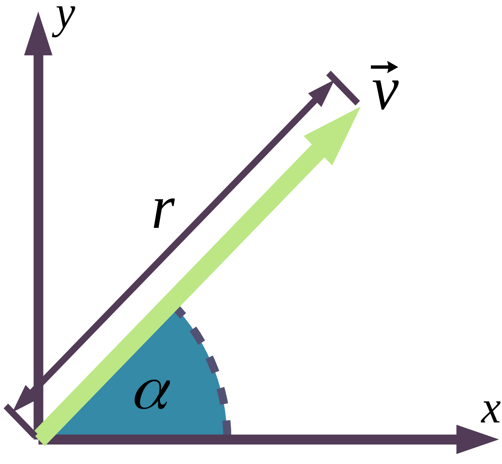
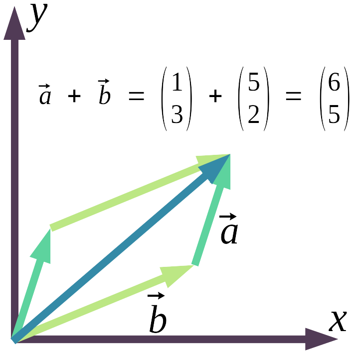
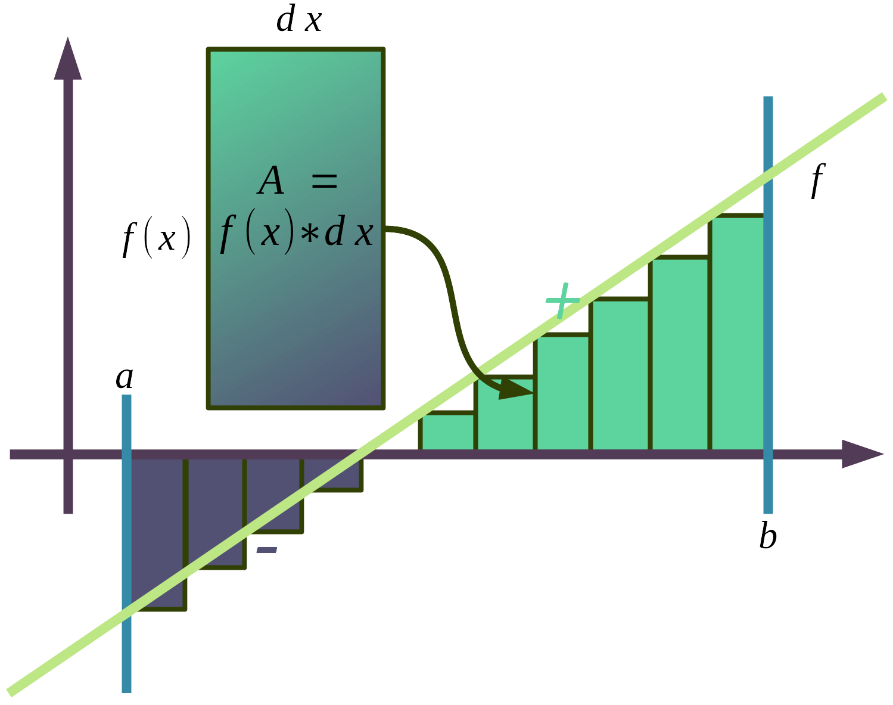
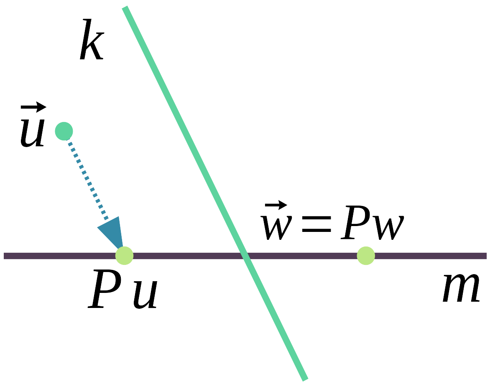
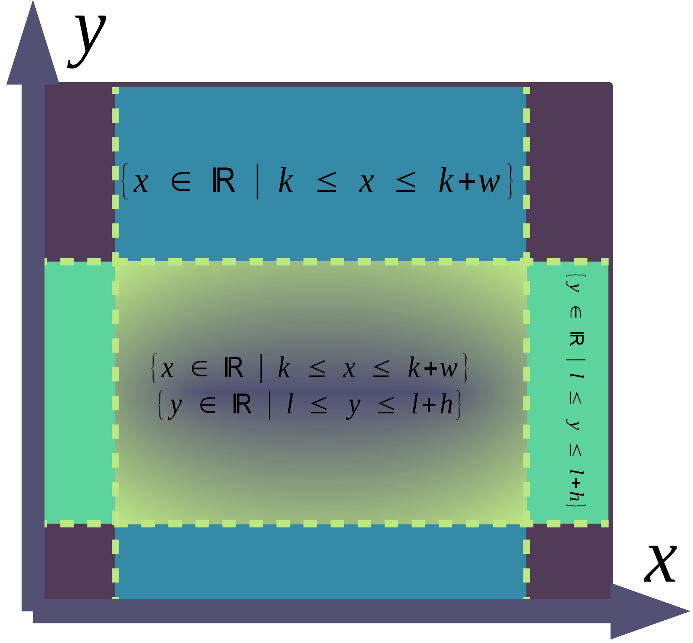
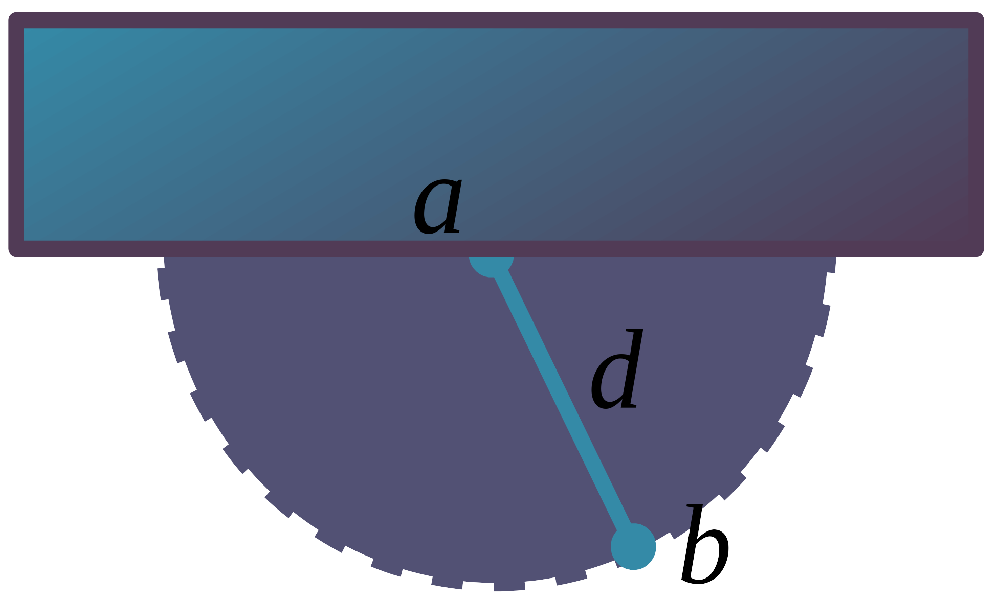
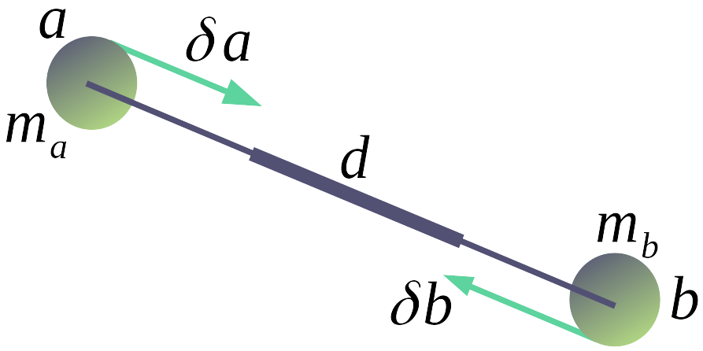

> Beachte: Die folgende Arbeit wurde für Schüler aus dem Level des letzen Jahr der Sekundarstufe I geschrieben.

   
   <canvas id="glcanvas" tabindex='1'></canvas>
   
   

- **Betreuer**: Lucas Völkel
- **Lektoren**: Jonathan Schöps, Daniel Schöps
- **Komplexe Leistung** in Zwickau am _**Clara-Wieck-Gymnasium**_

> _„Constraints are as fundemental in game physics, as shaders are in computer graphics“_ - **Erin Catto**

# Inhalt

- [Inhalt](#inhalt)
  - [1. Einleitung](#1-einleitung)
    - [1.1 Hinführung zur physikalischen Simulation am Computer](#11-hinführung-zur-physikalischen-simulation-am-computer)
  - [2. Mathematische Grundlagen](#2-mathematische-grundlagen)
    - [2.1 Vektoren[^1] [^2]](#21-vektoren1-2)
    - [2.2 Integrale[^1] [^2]](#22-integrale1-2)
    - [2.3 Projektion[^1]](#23-projektion1)
    - [2.4 Die Ortsfunktion[^3] [^7]](#24-die-ortsfunktion3-7)
    - [2.5 Kollisionserkennung – Punkt in AABB[^5]](#25-kollisionserkennung--punkt-in-aabb5)
  - [3. Physikalische Grundlagen](#3-physikalische-grundlagen)
    - [3.1 Newtonsche Gesetze](#31-newtonsche-gesetze)
    - [3.2 Massepunkte](#32-massepunkte)
    - [3.3 Bewegung des Massepunktes[^3]](#33-bewegung-des-massepunktes3)
  - [4. Zwangsbedingungen](#4-zwangsbedingungen)
    - [4.1 Einführung in Zwangsbedingungen und deren Wirkung](#41-einführung-in-zwangsbedingungen-und-deren-wirkung)
    - [4.2 Erzwungener Abstand](#42-erzwungener-abstand)
    - [4.3 Projektion in den erzwungenen Abstand](#43-projektion-in-den-erzwungenen-abstand)
  - [5. Implementation](#5-implementation)
    - [5.1 Programmaufbau und Ablauf](#51-programmaufbau-und-ablauf)
    - [5.2 Implementation in Lua](#52-implementation-in-lua)
  - [6. Auswertung](#6-auswertung)
- [7. Quellen](#7-quellen)
  - [7.1 Bilder _M_](#71-bilder-m)
  - [7.2 Referenzen _B_ und Entnommen _E_](#72-referenzen-b-und-entnommen-e)

## 1. Einleitung

### 1.1 Hinführung zur physikalischen Simulation am Computer

Ein Computer ist eine Datenverarbeitungsmaschine. Anhand einer Anleitung, Programmcode genannt, schreibt er Daten auf ein Speichermedium, löscht, ändert, verschiebt sie. Das macht er weitaus schneller als ein Mensch, welchem abstrakte Dinge und Verwaltung schwer fallen. Daher kommt der Name, Computer waren Hilfskräfte von Mathematikern, die für sie mühsame und langweilige Rechnungen ausführten, also das, was heute unser Taschenrechner macht, der auch ein Computer ist. Als im letzten Jahrhundertdie ersten speicherbasierten, elektronischen Computer aufkamen, fanden sie Anwendung in großen Räumen, verschlüsselten Nachrichten und führten lange Berechnungen aus. Damit nahmen sie Mathematiker den mühsamen Teil ab und sie konnten sich auf das Theoretische konzentrieren. Zuerst war diese numerische Verarbeitung der wesentliche Anwendungsbereich des Computers.[^1]

Die ansteigende Komplexität, die durch integrierte Schaltkreise, also kleine Platinen auf denen Leiterbahnen eingeätzt sind, und immer kleineren Transistoren, den wichtigsten elektronischen Bauteilen eines Computers, wurde deutlich unterschätzt. Laut _„Moore’s Law“_, was zugleich das Motto der riesigen Computerindustrie ist, verdoppelt sich die Anzahl der Komponenten regelmäßig, etwa aller 2 Jahre, heute liegt sie im Milliarden Bereich von Transistoren pro CPU, der Zentralen Prozessoreinheit des Computers. So ist der Computer immer schneller geworden und konnte sich verschiedensten Aufgaben widmen. Er hat den Mensch in fast jeder, für den Menschen einfachen, aber langwierigen Aufgabe wegrationalisiert und gab Ausschlag für Industrie 3- und 4.0. Er ist als kleiner Mikrochip in fast jedem technischen Gerät eingebaut, macht mobil, immer erreichbar, informiert, verbindet, unterhält und ist Forschungswerkzeug. Computer haben einen erheblichen Einfluss auf unser Leben, vom autonomen Fahren über Geldverwaltung bis hin zu Klimamodellen, die auf Supercomputerlaufen, oder trivial, die Videospielekonsole. Schon lange versucht man mit Hilfe der Vergangenheit die Zukunft vorauszusagen. In ihr lassen sich Muster erkennen. Diese können wir fortführen und mit Hilfe des jetzigen Zustandes Aussagen über die Zukunfttreffen. Das nennt man Extrapolation. So etwas tun Historiker, Politiker, aber auch Physiker, dazu benutzen sie die genaue Sprache der Mathematik. Mit ihr lassen sich abstrakte Aussagen aufstellen. Die Lösung dieser ist aber nicht einfach, für ein genaues Ergebnis braucht es keine Intuition, sondern das sture Befolgen von Regeln.

Da kommt der Computer ins Spiel, denn er ist bestens dafür geschaffen. Virtuelle Experimente, Simulationen und Videospiele, versuchen die Realität nachzuahmen. Computerprogramme beschreiben ein Modell, welches Gleichungen und Eingangswerte zum Verlauf der Simulation enthält und geben spätere Zustände aus. Solche sind aufgrund der eingeschränkten Rechenleistung idealisiert, das heißt unwesentliche Einflüsse werden komplett ausgelassen. Glücklicherweise lassen sich mit höherem Zeitaufwand, mehr Speicher oder schnelleren Computern genauere Zustände beschreiben und weniger Konkrete in geringerem Zeitaufwand oder mit schwächeren Rechnern. Zeitlich weiter entfernte Ergebnisse sind ungenauer und auf die nächste Zukunft lässt sich sagen: es wirdsich nichts ändern. Diese Idee des Laplaceschen Determinismus, das alles sich voraussagen liese, hätte man nur den genausten Zustand des Jetzt, wird angewendet, auch wenn dieser insofern nicht mehr gilt, das es seit der Quantenmechanik mehrere wahr scheinliche Ergebnisse gibt[^10]. Das ist aber zu ignorieren, sobald es um makroskopische Simulationen geht, nicht um atomare Größen. Trotzdem sind die Modelle, also Nachahmungen der Realität, hoch komplex und es erfordert bestes mathematisches Verständnis. Der Umfang dieser Arbeit ist zu gering, um Quaternionen und Tensoren, mit denen Rotationsdynamikbeschrieben wird, zu erklären. So stellt sich die Frage, ob mit Hilfe des Computers sich einfache Modelle aufstellen liesen, welche mehr Rechenzeit benötigen, die uns aber der Computer abnimmt.

## 2. Mathematische Grundlagen

### 2.1 Vektoren[^1] [^2]

In der Mathematik und Physik sind Vektoren grundlegende Elemente von Gleichungen, die Objekte im Raum und deren Bewegung betreffen. Sie fassen mehrere Dimensionen, also mehrere Werte in einem Objekt zusammen, einer Variablen. Ein Vektor kann auch richtungsweisend Wachstum angeben oder beispielsweise Wahrscheinlichkeiten einer Superposition in der Quantenmechanik[^10], er hat also vielzählige Anwendung.

Ein Vektor besitzt:

- Richtung $\alpha$
- Länge $r$

Er enthält diese aber nicht direkt, sondern Koordinaten. Im Gegensatz zu einem Punkt, gibt der Vektor keine Position an, denn er zeigt vom Koordinatenursprung auf eine Position, die seine Komponenten, also die einzelnen Zahlen im Vektor, beschreiben. Somit gibt der Vektor eine Verschiebung (_„Verschiebungsvektor“_) an. Allerdings dient er trotzdem oft der Einfachheit halber als Punktersatz und gibt Positionen (_„Ortsverktor“_) direkt an.

Variablen, die Vektoren tragen werden oft, wie auch in dieser Arbeit, ein Pfeil ($\vec v$) aufgesetzt. Einzelne Komponenten sind geordnet von oben nach unten aufeinander oder nebeneinander in einer runden Klammer geschrieben. Ein Element im Vektor $\vec v$ and der Stelle $i$ wir als "$\vec v_i$" angegeben. Dabei beschränkt sich $i$ nicht nur auf positive ganze Zahlen $\N$, sondern es werden auch wörtliche Bezeichnungen und Buchstaben benutzt wie: $x$ $w$. Je ein Element "$\vec v_i$" ist Teil der Menge namens $\mathbb I$. Geometrisch ist jeder Menge eine Achse zugeordnet, entlang dieser gibt der zugehöriger Wert Verschiebung an. Vektoren werden so anhand der Werte ihrer Komponenten und des Types unterschieden. Die Zahl $n$ an Komponenten wird als Vektor $n$.-Dimension bezeichnet. Die Menge aller Vektoren des gleichen Typen, die sich aber anhand ihrer Werte unterscheiden, wird als Vektorraum bezeichnet.

Für Addition, Multiplikation und deren Inversion zwischen zwei Vektoren gilt:

$$\vec a + \vec b = (a_1 + b_1, a_2 + b_2, \dots, a_{i-1} + b_{i-1}, a_i + b_i)$$

$$\vec a * \vec b = (a_1 * b_1, a_2 * b_2, \dots, a_{i-1} * b_{i-1}, a_i * b_i)$$

Es wird komponentenweise addiert, subtrahiert, multipliziert und dividiert. **M3** zeigt wie die Addition veranschaulicht werden kann. Man setzt den lokalen Koordinatenursprung des zweiten Pfeils an den Ersten.

Für die Multiplikation zwischen einem Vektor und einer reellen Zahl („Skalierung“) $\vec v; n$ gilt:

$$n * \vec v = (n * v_1, n * v_2, \dots, n * v_{i-1}, v * v_i)$$

Es wird wieder komponentenweise multipliziert oder dividiert.

Es gibt viele weitere Operationen und Eigenschaften, erwähnenswert sind noch:

- Vektorlänge aus Satz des Pythagoras: $|\vec v| = \sqrt{v_1^2 + v_2^2 + \dots + v_{i-1}^2 + v_i^2}$
- Vektornormalisierung setzt die Vektorlänge auf den Einheitskreis, damit $|\vec v| = 1$: $\frac{\vec v}{|\vec v|} = (\frac{v_1}{|\vec v|}, \frac{v_2}{|\vec v|}, \dots, \frac{v_{i-1}}{|\vec v|}, \frac{v_i}{|\vec v|})$

In der Informatik wird ein Vektor viel mehr als Liste geordneter Zahlen verstanden,frei von einer direkten Zuordnung als Position oder Beschleunigung fasst er Eigenschafteneines Objektes oder mehrere Werte einer Eigenschaft zusammen. Ein Vektor in Lua:

> _**Definition**_: Ein Vektor $\vec v = (v_1, v_2, \dots, v_{i-1}, v_i)$ ist ein mathematisches Objekt, welches eine Verschiebung im Raum beschreibt. Die Anzahl $n$ der Komponenten wird als Vektor $n$-ter Dimension bezeichnet. Dargestellt wird er in einer Variable mit aufgesetztem Pfeil, die eine Tupel (also eine endliche Liste) geordneter, reeller Zahlen enthält. Geometrisch veranschaulicht wird der Vektor mit Hilfe eines Pfeiles, welcher vom Koordinatenursprung zum Punkt des Vektors zeigt. Die Evaluierung von Operatoren zwischen Vektoren wird komponentenweise abhängig vom zugeordneten Index oder Bezeichnung ausgeführt, soweit diese vorhanden ist.

### 2.2 Integrale[^1] [^2]

Integrale sind, neben Vektoren, das entscheidende Element zur Lösung von Bewegungsgleichungen, aber auch in vielen anderen Bereichen zu finden. Isaac Newton, ein englischer Forscher und Gottfried Wilhelm Leibniz, ein deutsches Universalgenie, formulierten beide Ende des 17. Jahrhunderts unabhängig voneinander den Fundamentalsatz der Analysis, der die Berechnung des Integrals und dessen Umkehrung, die Ableitung, beweist. Der Integral gibt die Fläche unter einer Funktion an. Um diese exakt zu berechnen gibt es keine immer konkrete Vorgehensweise. Nur bei einfachen Fällen sind exakte Lösungen vorhanden, beispielsweise die der gleichförmigen Bewegung, in welcher die Funktion im zu berechnenden Integral immer den gleichen Wert ergibt. Sonst lässt sich der Integral oft nur approximieren, also annähern und wird somit zur Grenzwertfunktion, der eigentliche Wert wird nicht gefunden.

Um den (bestimmten) Integral zu berechnen, unterteilt man die Fläche in Streifen, wie **M4** zeigt. Je kleiner diese Rechtecke, umso genauer kann die Fläche berechnet werden. Die Höhe eines Streifens bestimmt der Funktionswert zur Position des Streifens $f(x)$, hier wurde immer die linke Ecke benutzt. Das nennt man Eulersche Integration. Mann kann aber auch die Mitte $f(x + \frac{dx}{2})$ oder das Ende eines Streifens $f(x + dx)$ als Schnittpunkt mit der Funktion wählen.Verschiedene Methoden sollten anhand der geforderten Genauigkeit und Komplexitätgewählt werden. Die Breite des Rechteckes ist die Schrittgröße $dx$ des Integrals. Die Flächen aller Rechtecke werden aufsummiert und bilden die Gesamtfläche.

Berechnung des Integrals in Lua:

> _**Definition**_: Der Integral $\int_{a}^{b}{f(x) * dx}$ ordnet einer Funktion ihre grundlegende Fläche zu. Er wird aus der Summe aller Rechtecke ($f(x) * dx$) der Höhe von jeweils dem Funktionswert aus jeder reellen Zahl in $[a, b]$ und Breite der Veränderung $dx$ zweier aufeinander folgenden Argumente gebildet. Da unendliche viele reelle Zahlen zwischen $a$ und $b$ liegen, muss der Integral approximiert werden, indem die Menge der Zahlen auf endlich reduziert wird. Das heißt $x \in \{\N * dx \mid a \leq x \leq b\}$ anstatt $x \in [a, b]$. Mit $dx \to 0$ und $n = \frac{b - a}{dx}$ gilt: $\int_a^b{f(x)*dx} = \lim_{n \to \inf}{\sum_{k=0}^n{f(a + dx * k) * dx}}$. Somit ist der Integral eine Grenzwertfunktion.

### 2.3 Projektion[^1]

Projektion ist das neu Zuordnen eines Wertes in einem Vektorraum $\mathbb V = \R^n$ auf einen anderen Raum $\mathbb T = \R^k$. Dabei gilt $\mathbb T \neq \mathbb V$. Es gibt viele verschiedene Methoden zur Projektion, wichtig ist aber, dass aus Sicht von $\mathbb T$ sich nichtsändert. Oft wird dafür ein zu projizierender Wert entlang einer Achse verschoben und skaliert. Unter diesem komplizierten mathematischen Begriff finden sich eine Breite von Anwendungen. Bei einem Beamer (~„Projektor“) wird Licht von der 1-Dimensionalen Lichtquelle durch das gerichtete Fortbewegen auf eine 2-Dimensionale Wand projiziert. In der Computergrafik werden 3-Dimensionale Punkte auf den 2-Dimensionalen Bildschirm mit Hilfe einer perspektivischen Projektionsmatrix projiziert. **M5** zeigt eine Projektion aus dem 2-Dimensionalen Raum parallel zu $k$ auf $m$.

Ein einfaches mathematisches Beispiel ist 1-Dimensionale Projektion in zwei verschiedene Wertebereiche. Gegeben ist der Wert $x$ im Intervall $M = [a, b] = \{\R \mid a \leq x \leq b\}$ und ein zweiter Intervall $N = [c, d]$. Es soll $x$ in $N$ projiziert werden. Da $M$ und $N$ linear glatt sind, kann man das prozentuale Verhältnis $p$ von $x$ in $M$ mit Hilfe der Intervalllänge errechnen und daraus den projizierten Wert $y$ in $N$. Also $p = \frac{x}{b - a}$ multipliziert mal die Intervalllänge von $N$ plus den Startwert $c$. Somit ist $y$ aus $x$ in $M$ zu $N$: $y = x\div (b-a) * (d - c) + c$. Hier wird also $x$ entlang der 1-dimensionalen X-Achse um $c$ verschoben und mit dem Verhältnis beider Vektorlängenskaliert. Diese Gleichung ist in der Informatik besonders wichtig um beispielsweise einem Sinuswert $\{-1 \leq x \leq 1\}$ in einer RGB-Farbe in Rotanteil $\{0 \leq x \leq 255\}$ umzuwandeln.

Projektion in den zweiten 1-dimensionalen Wertebereich in Lua:

### 2.4 Die Ortsfunktion[^3] [^7]

Die Ortsfunktion $\vec x(t)$ gibt eine Position $\vec x_t$ über die Zeit $t$ an. Diese Position ist dieSumme aller vorherigen Geschwindigkeiten. Bleibt die Geschwindigkeit konstant mit gleichförmige Bewegung, so lässt sich die Position $\vec x_t$ zu Zeit $t$ mit $\vec x(t) = t * \vec x_0$ berechnen. Die Geschwindigkeit ist $x_0$ , weil sie eigentlich die Positionsveränderung über einen Zeitschritt angibt. Anders schreiben lässt sich das als $\underbrace{\vec x(t) = \vec x_0 * 1 + \dots + \vec x_0 * 1}_{t}$.

Wenn sich aber die Geschwindigkeit über die Zeit auch ändert, beispielsweise durch die Funktion $\vec v(t)$ beschrieben, dann müsste man jede einzelne Geschwindigkeit in Relationzum Zeitschritt aufaddieren. Daraus ergäbe sich dieses fraktale, also aus sich selbst bestehendes Muster:

$$
\small{
\vec x(t) = \underbrace{
   \underbrace{
      \vec v(\frac{0}{1} * \delta t) * \frac{\delta t}{1}}_{
         \underbrace{
            \vec v(\frac{0}{2} * \delta t) * \frac{\delta t}{2}}_{
               \dots
            } +
         \underbrace{
            \vec v(\frac{1}{2} * \delta t) * \frac{\delta t}{2}}_{
               \dots
            }
      } +
   \underbrace{
      \vec v(\frac{1}{1} * \delta t) * \frac{\delta t}{1}}_{
         \underbrace{
            \vec v(\frac{2}{2} * \delta t) * \frac{\delta t}{2}}_{
               \dots
            } +
         \underbrace{
            \vec v(\frac{3}{2} * \delta t) * \frac{\delta t}{2}}_{
               \dots
            }
      } +
   \dots +
   \underbrace{
      \vec v(\frac{t-1}{1} * \delta t) * \frac{\delta t}{1}}_{
         \underbrace{
            \vec v(\frac{2t-1}{2} * \delta t) * \frac{\delta t}{2}}_{
               \dots
            } +
         \underbrace{
            \vec v(\frac{2t-2}{2} * \delta t) * \frac{\delta t}{2}}_{
               \dots
            }
      } +
   \underbrace{
      \vec v(\frac{t}{1} * \delta t) * \frac{\delta t}{1}}_{
         \underbrace{
            \vec v(\frac{2t-1}{2} * \delta t) * \frac{\delta t}{2}}_{
               \dots
            } +
         \underbrace{
            \vec v(\frac{2t}{2} * \delta t) * \frac{\delta t}{2}}_{
               \dots
            }
      }
}_{t}
}
$$

Diese Gleichung faltet sich weiter auf bis zu einem infinitesimalen Zeitschritt. Also die nächst größer reelle Zahl über Null. Die Lösung der Ortsfunktion wird in 3.3 Bewegung des Massepunktes beschrieben.

### 2.5 Kollisionserkennung – Punkt in AABB[^5]

 Eine _„Axis Aligned Bounding Box“_ (AABB) ist ein Rechteck,beziehungsweise ein Quader, welcher parallel zu den Achsen eines Koordinatensystems liegt. Die Kollisionserkennung beschäftigt sich damit, ob ein Körpereinen Zweiten penetriert. Um mathematisch zu erkennen ob sich ein Punkt in einer AABB befindet, muss man an die Ausdehnung des Körpers auf eine Dimension herunterbrechen. Das bedeutet man muss auf allen Achsen des Koordinatensystems überprüfen, ob diejeweilige Koordinate des Punktes innerhalb der Ausdehnung des Quaders in dieser Achse liegt oder nicht. Liegt sie in allen, so befindet sich der Punkt innerhalb der AABB. Mit einer AABB von Position $(k, l, \dots)$ und einer Breite und Höhe $w$ $h$ $\dotsb$ st jede Position derinnerhalb $[(k, k + w), (l, l + h), \dots]$ auch in der AABB. **M6** zeigt inwiefern eine Position Teilder Menge ist.

AABB-Check in Lua:

## 3. Physikalische Grundlagen

### 3.1 Newtonsche Gesetze

Isaac Newton formulierte 1687 in seinem Hauptwerk „Philosophiae Naturalis Principia Mathematica“ die heute bekannten drei Newtonschen Gesetze. Sie legen die Grundlagen der Klassischen Mechanik. Mit diesen kann man die Bewegung von Körpern makroskopisch sehr gut beschreiben.

> **I** Trägheitsgesetz: _"Ein Körper verharrt im Zustand der Ruhe oder der gleichförmig geradlinigen Bewegung, sofern er nicht durch einwirkende Kräfte zur Änderung seines Zustands gezwungen wird."_[^13]

Das Trägheitsgesetz meint, dass der Geschwindigkeitsvektor $\vec v$ konstant ist, solange keine Kraft auf ihn wirkt. In der Realität ist dies nicht einfach zu beobachten, weil besonders Reibung, wenn auch nur an der Luft, schon Kraft genug aufbringt den Körper langsam zu entschleunigen.

> **II** Aktionsprinzip: _"Die Änderung der Bewegung ist der Einwirkung der bewegenden Kraft proportionalund geschieht nach der Richtung derjenigen geraden Linie, nach welcher jene Kraft wirkt."_[^13]

Das Aktionsprinzip bedeutet, dass je stärker die einwirkende Kraft, umso schneller die Bewegungsänderung. Auch ist die Kraft gerichtet und die Bewegungsänderung entspricht dieser Richtung. Ein Zusatz ist, dass die Bewegungsänderung abhängig von der Masse ist, je größer die Masse, umso geringer die Bewegungsänderung.

> **III** Actio und Reactio: _"Kräfte treten immer paarweise auf. Übt ein Körper A auf einen anderen Körper B eine Kraft aus (actio), so wirkt eine gleich große, aber entgegen gerichtete Kraft von Körper B auf Körper A (reactio)."_[^13]

Das Dritte Newtonsche Gesetz Actio und Reactio erklärt, bei dem Versuch einenKörper in Bewegung zu setzen, widersteht dieser abhängig von seiner Masse mit einerentgegengesetzten Kraft. Da diese Kräfte paarweise und entgegengesetzt auftreten hat daszur Folge, dass die Summe aller Kräfte in einem geschlossenen System gleich Null ist.

### 3.2 Massepunkte

Ein Massepunkt ist eine Abstraktion eines Körpers. Er hat keine Ausdehnung und besteht aus:

- Position $\vec x$, für bewegten Massepunkt auch eine Geschwindigkeit $\vec v$
- Masse $m$
- Inverse masse $w = m^{-1}$ (da sie oft gebraucht wird, ist sie hier aufgelistet)

Das er keine Ausdehnung hat bedeutet, dass er sich in verschiedenen Rotationswinkeln um seine Achse nicht unterscheiden lässt und er kann auch physikalisch mit seiner Rotationnicht die Bewegung anderer Körper beeinflussen. Somit hat er in seiner Bewegung nur Translationsfreiheitsgrade, also Verschiebung parallel zu den Achsen des Koordinatensystems. Der Massepunkt wird häufig in physikalischen Berechnungen genutzt weil die Rotation eines Körpers gerade wegen des Ignorierens von Luftwiederstand in idealisierten Modellen zum Beispiel im Flug keinen Unterschied macht. In den man in jedem Simulationsschritt die Geschwindigkeit des Massepunktes mit einem Luftwiderstandskoeffizienten $r \in [0, 1] = \{\R \mid 0 \leq r \leq 1\}$ multipliziert, kann man dennoch, wenn der Massepunkt Bestandteil eines komplexeren Körpers ist, Reibung an der Luft simulieren. Man kann auch Elastizität simulieren, indem man während eines Kollisionskontaktes die Geschwindigkeit dämpft. Das geschieht wie beim Luftwiederstand mit einem Elastizitätskoeffizienten $e \in [0, 1] = \{\R \mid 0 \leq e \leq 1\}$.

### 3.3 Bewegung des Massepunktes[^3]

Die Bewegung des Massepunktes beschreiben die Newtonschen Gesetze. Damit sich der Massepunkt bewegt, braucht es eine einwirkende Kraft oder eine ursprüngliche Geschwindigkeit. An dieser bewegt er sich linear entlang, wenn keine weitere Kraft einwirkt. Meistens aber wirkt die Gravitation auf den Massepunkt und andere externe Kräfte $\vec f$ wie eine Kollisionsreaktion. Wenn von zwei Seiten Kräfte wirken, dann gleichen sie sich aus,dass heißt der Körper bewegt sich deshalb dann nicht. Die Geschwindigkeit zu einem bestimmten Zeitpunkt ist die Geschwindigkeit vom Zeitpunkt davor plus die Beschleunigung, welche relativ zur Masse steht, multipliziert mal den Zeitschritt. Also $\vec v = \int_0^t{\vec f_t * w * dt}$. Hier wird der Integral sichtbar, denn die Geschwindigkeit $\vec v$ ist auch
eine ununterbrochene Funktion nach Zeit, die nicht immer nur konstant ist.

So ist die Position $\vec x$ die Summe aller vorherigen Geschwindigkeiten mal $\epsilon$ (die
Infinitesimale), beziehungsweiße $dt$. Somit gilt $\vec x(t) = \int_0^t{\vec v(t) * dt}$, $\vec x(t) = \int_0^t{(\int_0^t{\vec f * w * dt}) * dt}$. Für eine fortlaufende Simulation mit gegebenen einwirkenden Kräfte $\vec f$, sowie eventueller Startposition- und Geschwindigkeit $\vec x_0$ $\vec v_0$ und Schrittgröße $\delta t$ muss in jedem Zeitschritt allerdings nur folgendes berechnet werden (Eulersche Methode):

$$
\begin{aligned}
   t &= t + \delta t \\
   \vec v &= \vec v + \vec f * \delta t \\
   \vec x &= \vec x + \vec v * \delta t
\end{aligned}
$$

Es gibt auch andere Möglichkeiten die fortlaufende Bewegung zu berechnen indem man zum Beispiel anders integriert. Eine zweite Methode wäre die Verlet Integration. Diese wird auch in der Implementation der Simulation genutzt, weil dann die Projektion der Zwangsbedingungen einfach einzubauen ist, da Positionen direkt manipuliert werden und nicht Geschwindigkeiten. Zunächst ist auch gleiches wie oben zu wissen. Dann wird fortlaufend folgendes berechnet:

$$
\begin{aligned}
   t &= t * \delta t \\
   \vec v &= \vec v + \vec f * \delta t \\
   \vec p &= \vec x + \vec v * \delta t \\
   \vec v &= (\vec p - \vec x) \div \delta t \\
   \vec x &= \vec p
\end{aligned}
$$

Der Vorteil dieser Methode ist, dass wenn $\vec p$ durch die Projektion der Zwangsbedingungen manipuliert wird, verändert sich auch $\vec v$ daher kommt der Name _„Positions bedingte Dynamiken“_.

## 4. Zwangsbedingungen

### 4.1 Einführung in Zwangsbedingungen und deren Wirkung

Zwangsbedingungen („Constraints“) sind der der entscheidende Teil, welcher aus der unabhängigen Bewegung der Massepunkten, starre, weiche und komplexe Körper schafft. Dies geschieht, indem sie Massepunkte verbindet, und in ihrer Bewegung zu- und voneinander indirekt einschränkt. Eine Bedingung $C(\vec x): \R^n \to \R$[^12] ist eine Funktion, die den Zustand eines Systems $\vec x$ annimmt und einen einzelnen Wert $y$ ausgibt, der beschreibt, inwiefern dieses System der Bedingung zuwiderläuft. Es gibt zwei verschiedene Arten in denen eine Bedingung erfüllt sein kann[^12]. Erfüllt wenn ihr Wert:

- Gleichheit (_"equality"_): gleich Null ist ($C(\vec x) = 0$).
- Ungleichheit (_"inequality"_): größer oder gleich Null ist ($C(\vec x) \geq 0$).

Wie stark diese umgesetzt werden sollen beschreibt ein Festigkeitskoeffizient[^12] $k \in [0, 1]$, welcher mit dem Funktionswert multipliziert wird. Umso kleiner der Festigkeitskoeffizient, desto näher ist die Funktion daran, erfüllt zu werden. So gibt es starre und weiche Bedingungen.

Außerdem unterscheidet man Zwangsbedingungen noch in der Art des Systems und was sie einschränken[^12]:

- Abstand zweier Punkte soll erfüllt sein (_"Distance C."_)
- Winkel zwischen zwei Punkten soll erfüllt sein (_"Bending C."_)
- Volumen eines Körpers, beschrieben durch Eckpunkte soll erfüllte sein (_"Volume C."_)
- Kollision, in erster Körper darf einen Zweiten nicht schneiden (_"Collision C."_)

Für unsere Simulation sind nur Zwangsbedingungen auf den Abstand wichtig, mit ihnen kann man auch teilweise die anderen Bedingungen umsetzen.

**M7** zeigt wie die Position des Massepunktes durch die Länge des Fadenpendels eingeschränkt ist. Solches Verhalten lässt sich auch mit Zwangsbedingungen modellieren.

### 4.2 Erzwungener Abstand

Funktionen, die den Abstand zwischen zwei Massepunkten einschränken, sind wie Stöcke. Die Position und Rotation des Stockes lassen sich von den Positionen seiner beiden Enden beschreiben. Allerdings wird ein Stock nicht länger oder kürzer werden, somit können sich beide Enden nicht frei im Raum bewegen, sondern der Abstand muss immer der Gleiche sein. Solch eine Funktion besteht aus[^12]:

- einer Länge $d$
- die Position zweier Massepunkte $\vec a$ $\vec b$
- einem Festigkeitskoeffizienten $k$

Aus diesen Werten wird die Funktion $C$ gebildet. Diese soll Null sein, wenn der Abstand zwischen $a$ und $b$ gleich $d$ ist und immer größer werden, desto mehr sie sich entfernen. Der Abstand zwischen
$\vec a$ und $vec b$ lässt sich mit dem Satz des Pythagoras berechnen. Die Hypotenuse ist die Länge $\sqrt{(a_x - b_x)^2 + (a_y - b_y)^2}$ also $|\vec a - \vec b|$ (Kurzschreibweise).

So kann man die Constraint als $C(\vec a, \vec b) = (|\vec a - \vec b| - d) * k$[^12] schreiben.

### 4.3 Projektion in den erzwungenen Abstand

Nun gilt es diese Funktion auf die Position der beiden Massepunkte zu projizieren.Die Position der Punkte soll so verändert werden, dass die Bedingung erfüllt ist. DieRichtung, also der Vektor $\vec r$ der von Punkt $\vec a$ zu $\vec b$ zeigt, lässt sich aus der Differenzzwischen den beiden Punkten berechnen: $\vec a - \vec b$. Dieser Vektor muss nun normalisiertwerden damit die Länge 1 ist. Dazu wird $\vec r$ von der Vektorlänge dividiert. Zusammengesetzt sie das so aus: $\frac{\vec a - \vec b}{|\vec a - \vec b|}$. Das bildet den Strahl, entlang welchem die Punkte verschoben werden müssen, um sie in den geltenden Funktionsbereich zu projizieren. Die Stärke der Verschiebung, sprich die ehemalige Vektorlänge, ist der Wert der Funktion der Zwangsbedingung. Der erste Massepunkt muss entgegengesetzt zum Zweiten verschoben werden. Somit entsteht die Verschiebung von $\vec a$ und negativ die gleiche für $\vec b$:

$$\delta \vec a = k * (|\vec a - \vec b| - d) * \frac{\vec a - \vec b}{|\vec a - \vec b|}$$

Da beide Punkte Massepunkte sind, also auch eine Masse haben, soll diese in die Gleichung so einfliesen, dass die beidseitige Verschiebung im Masseverhältnis gewichtet ist. Dazu muss der Anteil des Massepunkte an der Gesamtmasse berechnet werden. Das geschieht für $a$ mit $\frac{w_a}{w_a + w_b}$ beziehungsweise
$\frac{w_b}{w_a + w_b}$ für $b$. Somit lässt sich eine Distance Constraint folgendermaßen projizieren[^12]:

$$
\begin{aligned}
   \delta \vec a &= \frac{w_a}{w_a + w_b} * k * (|\vec a - \vec b| - d) * \frac{\vec a - \vec b}{|\vec a - \vec b|} \\
   \delta \vec b &= - \frac{w_b}{w_a + w_b} * k * (|\vec a - \vec b| - d) * \frac{\vec a - \vec b}{|\vec a - \vec b|}
\end{aligned}
$$

Die Projektion der Punkte in Lua. Wiederholende Werte wie die Vektordifferenz oder die Länge werden extra zwischengespeichert:

## 5. Implementation

### 5.1 Programmaufbau und Ablauf

Die Simulation läuft fortwährend nach Start des Programms. Zu Beginn sind Eingangsvariablen zu wählen (ein _„Statevector“_). Das zu simulierende System ist eine Menge von Massepunkten und Funktionen der Zwangsbedingungen. Das visuelle Abbild eines Zeitschrittes wird am Ende dessen aktualisiert.

Der Ablauf des Programms sieht folgendermaßen aus[^12]:

0. Lege Zeitschritt $\delta t$ fest, Luftwiderstandskoeffizient $r$ und wirkende Kräfte $\vec f$ wie Gravitation

1. Initialisiere Massepunkte mit Position $\vec x$, Geschwindigkeit $\vec v$ und inverser Masse $w = m^{-1}$

2. Initialisiere Funktionen der erzwungenen Abstände mit Länge $d$, Festigkeit $k$ und Stellen $i$ $j$ der Massepunkte

3. Für jeden Massepunkt bei $d$:
   1. aktualisiere Geschwindigkeit: $\vec v_i = \vec v_i + \delta f * w_i * \delta t$
   2. (dämpfe Geschwindigkeiten: $\vec v_i = \vec v_i * r$)
   3. setze nächste Position: $\vec p_i = \vec x_i + \vec v_i * \delta t$

4. Für jede Constraint $C$ mit Stelle $i$ $j$:
   1. projiziere Constraint:

$$
\begin{aligned}
    \vec a &= \vec a + \frac{w_a}{w_a + w_b} * k * (|\vec a - \vec b| - d) * \frac{\vec a - \vec b}{|\vec a - \vec b|} \\
   \vec b &= \vec b - \frac{w_b}{w_a + w_b} * k * (|\vec a - \vec b| - d) * \frac{\vec a - \vec b}{|\vec a - \vec b|}
\end{aligned}
$$

5. Für jeden Massepunkt bei $i$:
   1. akquiriere Geschwindigkeit: $\vec v = (\vec p - \vec x) \div \delta t$
   2. setze endgültige Position: $\vec x = \vec p$

6. Wiederhole ab 3.

### 5.2 Implementation in Lua

Lua ist eine Skriptsprache mit einem ursprünglich stark wissenschaftlichen Bezug. Sie wurde 1993 an der Universität PUC-Rio entwickelt. Lua ist sehr einfach zu lesen, denn sie gleicht stark dem Englischen und benutzt weniger Sonderzeichen. Deshalb wird sie in dieser Arbeit auch in den Beispielen benutzt. Man ordnet Lua folgende Eigenschaften zu[^14]:

- interpretiert: Code wird direkt vor dem Ausführen kompiliert, auch CLI möglich
- leichtgewichtig: 297kB, läuft daher auch auf Mikrocontrollern
- schwach, dynamisch: Typen werden interpretiert, können geändert werden
- eingebettet: ergänzt in vielen Anwendungen C/C++, einfach implementiert
- funktional: globale Daten werden in Funktionen geändert, weitergegeben

Mit Metatables ist auch objektorientierte Programmierung möglich, da diese aber umständlich implementiert ist, wird nicht mit Methoden, sonder mit typspezifischen Funktionen gearbeitet. Das bedeutet der Argumenttyp ist im Namen der Funktion zu erkennen. Diese Funktion nimmt ein Objekt an, verändert es und gibt es wieder aus oder speichert es direkt, da Funktionen in Lua globalen Zugriff haben. Objekte des gleichen Typs werden nach Erschaffung in einer Liste gespeichert und in jedem Zeitschritt aktualisiert. Da jeweils über die Listen iteriert wird, sind Schritte in 5. über 3.0, aber in 3. gesetzt, um effektiver zu sein. Außerdem, damit sich keine Massepunkte außerhalb des Fensters bewegen, prallen sie daran ab. Das geschieht jeweils mit einem 1-Dimensionalen AABBKollisionstest. Wenn dieser positiv ist, wird die Geschwindigkeit auf dieser Achse umgekehrt, sowie die Position in einen validen Bereich gesetzt.

Zur Visualisierung und interaktiven Gestaltung wurde LÖVE-2D benutzt, ein Opensource Spiele Framework. Diese Implementation ist 2D, alles funktioniert abergenauso in 3D, da an keiner Stelle mit Rotation gerechnet werden muss.

Der komplette Quellcode, sowie die Programme für Linux und Windows befinden sich auf:

[github.com/m4dh0rs3/PBD/]()

## 6. Auswertung

Das Ziel der Facharbeit war eine einfache Methode vorzustellen, die es dennoch ermöglicht starre und weiche Körper zu simulieren. Im Hinblick auf das fertiggestellte Programm ist dies definitiv möglich. Rein visuell fallen wenig Fehler auf, nur wenn die Geschwindigkeiten oder die Komplexität sehr hoch ist, führt das meist zu einer akkumulierenden Überreaktion. Mit genügend Auswichtung der Simulationswerte wie Gravitation, Zeitschritt, Luftreibung und den Massen kann auf jeden Fall ein beachtbares Ergebnis erzeugt werden. Zusätzlich bietet die PBD eine hohe Varietät in der Art des zu simulierenden Modells im Vergleich zu anderen Methoden. Wenn noch die Kollisionsbedingungen für dynamische Körper implementiert sind, kann man die Simulation für die meisten Zwecke als vollständig betrachten. Der nächste Schritt wäre eine 3-Dimensionale Implementation und eventuell in einer Low-Level Programmiersprache um die Leistung zu erhöhen. Außerdem könnte man mit Vertex-Shader, Programme, die auf der GPU laufen, massiv parallel arbeiten. Zur Zeit kann das Programm in Lua mit LÖVE-2D Massepunkte im Eintausender-Bereich simulieren. Mit einer Dichte-Bedingung ist auch das Simulieren von Wasser möglich ist, für ein visuell ansprechendes Ergebnis sind aber vielmehr Massenpunkte von Nöten. Auch für sehr einfache System wie ein Doppelpendel, welches in allen anderen Methoden schwieriger zu simulieren ist, kann die PBD-Methode helfen. So ist mit erhöhter Genauigkeit die Simulation auch für wissenschaftliche Zwecke geeignet. Das schlussendliche Programm hat auch einen Wert für den Unterricht, da anhand dessen zum Beispiel die Newtonschen Gesetze interaktiv erklärt werden können. Man könnte noch eine Integration mit dynamischen Zeitschritt einzubauen, um das Verhältnisvon Genauigkeit zu Zeitaufwand weiter zu optimieren. Verschiedenste Funktionen für Zwangsbedingungen können noch implementiert werden, auch wenn deren Projektion kompliziert ist. Eine visuelle Darstellung, ob eine Position die Zwangsbedingung erfüllt oder nicht, könnte hilfreich sein.

Ich hoffe diese Arbeit gibt einen Anfang in weiteren Versuchen die Realität nachzuahmen.Die Idee Modelle am Computer zu simulieren um sonst nicht umsetzbare Probleme zu behandeln und zu analysieren ist in diesem Jahrhundert besonders wichtig, da Experimente, die neue Einblicke liefern sollen, meist viel zu aufwendig sind.

Auch wenn dieses Projekt mich sehr viel Zeit gekostet hat, gab es mir einen umfangreichen Einblick in komplexere Mathematik und besonders die numerische Physik. Lange habe ich solche Methoden benutzt ohne zu wissen, was mathematisch dahinter steckt. Diese Arbeit hat ein größeres Interesse geweckt, die Mathematik in vielen neuen Themen anzuwenden. Schlussendlich hat die Simulation auch einen großen Unterhaltungswert und macht neugierig, wie das Ein oder Andere wohl funktioniert und was dahinter steckt.

# 7. Quellen

## 7.1 Bilder _M_

1. **42 Jahre CPU Entwicklung**, Daten von u. A. **K. Rupp**, einzusehen auf _github.com/karlrupp/microprocessor-trend-data/commits/master_
2. Vektor, **B. Schöps**
3. Vektoraddition, **B. Schöps**
4. Integral, **B. Schöps**
5. **Projektion an k zu m** von **J. Niesen**, überarbeitet von **B. Schöps**, einzusehen auf _commons.wikimedia.org/wiki/File:Oblique_projection.svg_
6. AABB Mengenbild, **B. Schöps**
7. Pendel, **B. Schöps**
8. **Constraint Projection**, aus **E1** _gleichnamiges Kapitel 3.3_, überarbeitet von **B. Schöps**
9. Lua Logo einzusehen auf _lua.org_
## 7.2 Referenzen _B_ und Entnommen _E_

[^1]: **„Essential Mathematics for Games and Interactive Applications“** von **J. Van Verth, L. Bishop**: _Kapitel 2: Vectors and Points, 6: Interpolation, 7: Viewing and Projection, 12.3.2: AABB, 13: Rigid-Body Dynamics_
[^2]: **„3D Math Primer for Graphics and Game Development“** von **F. Dunn, I. Parberry**: _Kapitel 2: Vectors, 11, 12: Mechanics, 11.7: The Integral_
[^3]: **„The Nature Of Code“** von **Daniel Shiffman**: _Kapitel 1: Vectors, 2: Forces, 4: Particle Systems_
[^4]: **„Physics for Game Developers“** von _D. Bourg, B. Bywalec_
[^5]: **„Game Physics Coockbook“** von _G. Szauer_
[^6]: **„Game Physics Engine Development“** von **I. Millington**
[^7]: Brilliant Kurse **„Classical Mechanics“**, **„Differential Equations 1“** (_brilliant.org_)
[^8]: Siggraph 1997 Kurs **„Physical based Modelling“** von **A. Witkin, D. Baraff**
[^9]: Siggraph 2019 Kurs **„Introduction to Physics-Based Animation“** von **A. Bargteil, T. Shinar**
[^10]: Vortrag **„Analogrechnen“** von **Bernd Ulmann** auf dem CCC
[^11]: **„A Brief History of Time“** von **Stephen Hawking**: _Kapitel 2: Space and Time_
[^12]: Paper **„Position Based Dynamics“** von u. A. **Matthias Müller**: _Kapitel 3: Position Based Simulation_
[^13]: **„Mathematische Prinzipien der Naturlehre“** von **Isaac Newton** (Dt. **J. PH. Wolfers**) (_zusammengefasst auf de.wikipedia.org/wiki/Newtonsche_Gesetze_)
[^14]: Website **„About Lua“** auf _lua.org/about_
